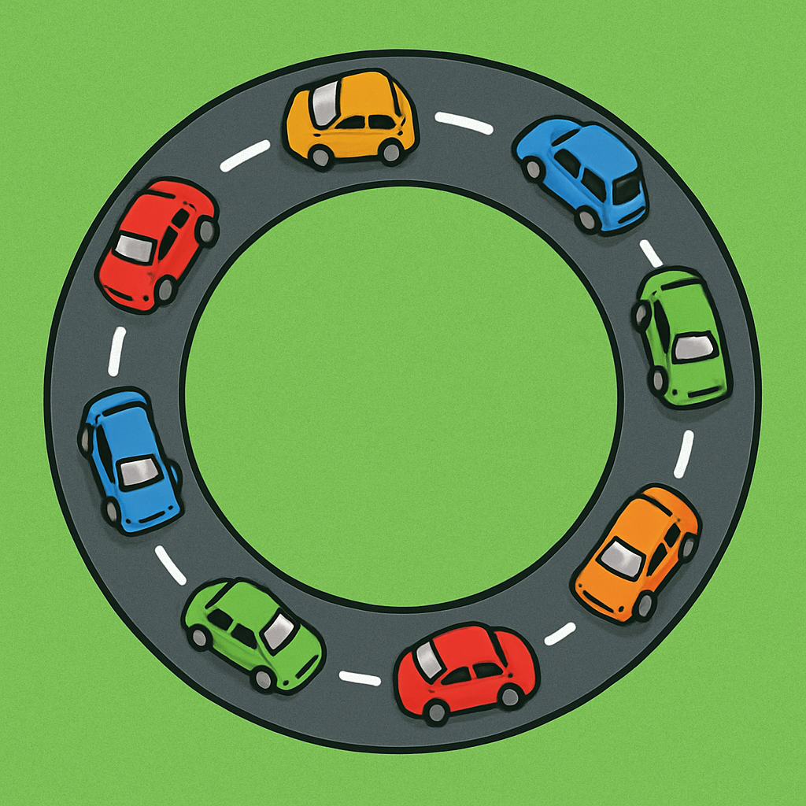

# Traffic Simulation of multi-lane highway

## Introduction
This project is aimed at simulating the dynamics of a multi-lane highway using a cellular automata.

Cars are modelled as points on a road with periodic boundary conditions with the positions of the cars being updated in discrete timesteps. The position of every car in the model is updates based on the position and velocity of other cars in its surroundings.

The purpose of the model is to provide insights into how parameters such as road length, car density and number of lanes affect traffic flow using a highly simplified model.

## Cellular automata

The highway dynamics are simulated using a cellular automata. The road is represented by a discrete grid with periodic boundary conditions.

## Structure
The main 

## How to use

## Report
A report has been written based on the findings made by running a series of simulations of the model. 
