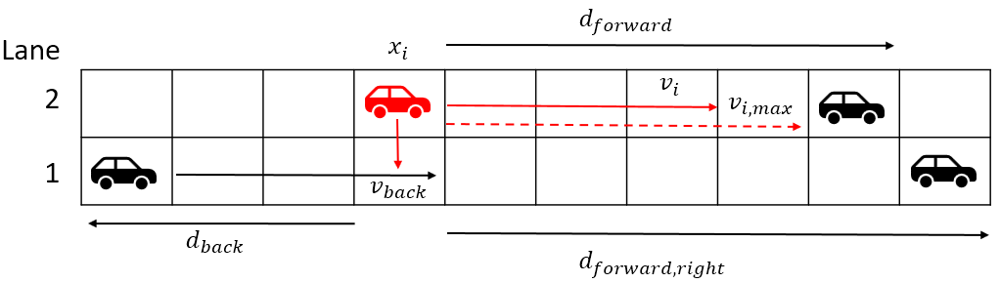

# Traffic Simulation of multi-lane highway

## Introduction
This project is aimed at simulating the dynamics of a multi-lane highway using a cellular automata.

Cars are modelled as points on a road with periodic boundary conditions with the positions of the cars being updated in discrete timesteps. The position of every car in the model is updates based on the position and velocity of other cars in its surroundings.

The purpose of the model is to provide insights into how parameters such as road length, car density and number of lanes affect traffic flow using a highly simplified model.

## Cellular automata

The highway dynamics are simulated using a cellular automata. The road is represented by a discrete grid with periodic boundary conditions. Parameters such as the number of cars, road length, number of lanes and maximum velocity can all be set by the user. Cars will have desired lane changes and velocity changes based on the relative position and speed of surrounding cars.

Details on the update rules for the cellular automata are provided in page 2 of
the [report](./report/Report.pdf)

## How to use
The main classes for the simulation are found in [main.py](main.py). To run file consists of three main public classes

- **Cars**: Stores the properties of each car in the model, such as position, velocity, and color.
- **Propagator**: Implements the update rules of the cellular automata.
- **Simulation**: Takes and instance of Cars and Propagators and runs the simulation.

For more instructions, please see the [demo](demo.py). 

## Report
A report has been written based on the findings made by running a series of simulations of the model. The report focuses on investigating how car density and number of lanes affect the flow rate on the highway. The PDF, data and figures are all found in the [report](./report/) directory. 
